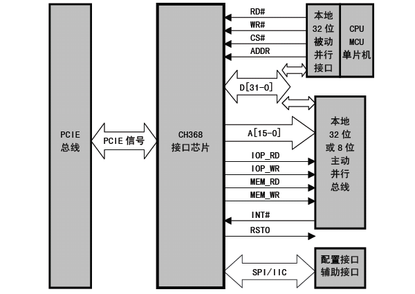

## [CH36x芯片](https://github.com/qful/intHUB) 

 

CH368是一个连接PCI-Express总线的通用接口芯片，支持I/O端口映射、存储器映射、扩展ROM以及中断。CH368将高速PCIE总线转换为简便易用的类似于ISA总线的32位或者8位主动并行接口，用于制作低成本的基于PCIE总线的计算机板卡，以及将原先基于ISA总线或者PCI总线的板卡升级到PCIE总线上。PCIE总线与其它主流总线相比，速度更快，实时性更好，可控性更佳，所以CH368适用于高速实时的I/O控制卡、通讯接口卡、数据采集卡等。