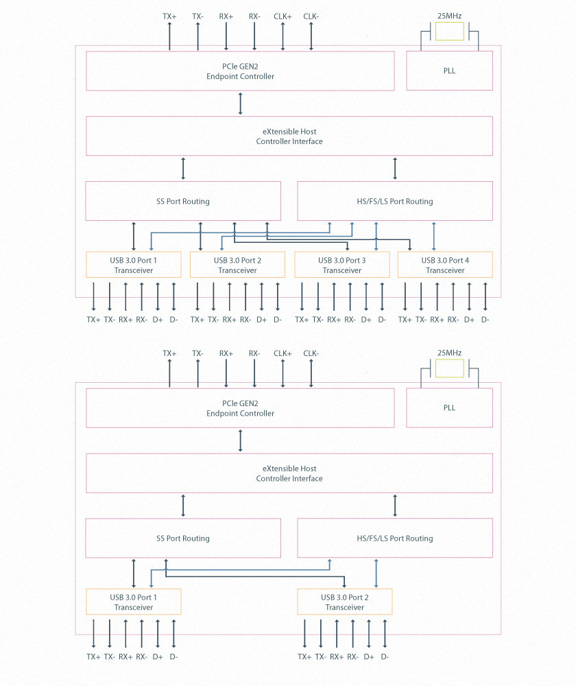

## [VL805](https://github.com/qful/VL805) 

#### Description

The VIA Lab’s VL805 (4-Port)/VL806 (2-Port) is a USB 3.0 Host controller, which enables a PCI Express equipped platform to interface with USB Super-Speed (5 Gbps), High-Speed (480 Mbps), Full-Speed (12 Mbps), and Low-Speed (1.5 Mbps) devices. The root hub consists of four downstream facing ports enabling the simultaneous operation of multiple peripheral devices.

The VIA Lab’s VL805/VL806 complies with the Universal Serial Bus 3.0 Specification and Intel's eXtensible Host Controller Interface (xHCI), and is fully backward compatible with USB 2.0 and 1.1 specifications, ensuring seamless connectivity of legacy USB devices. VL805/VL806 have a PCI Express 2.0 x1 interface backwards compatible with PCI Express 1.0 and is perfectly suited for both PC Host and Add-In Card applications.

 